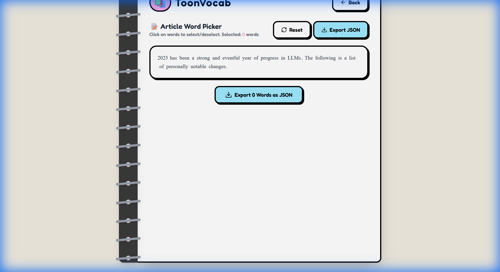
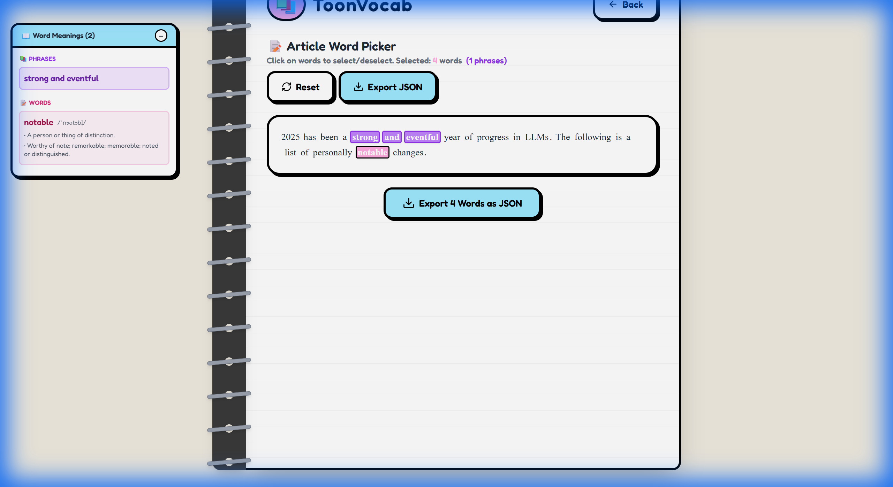
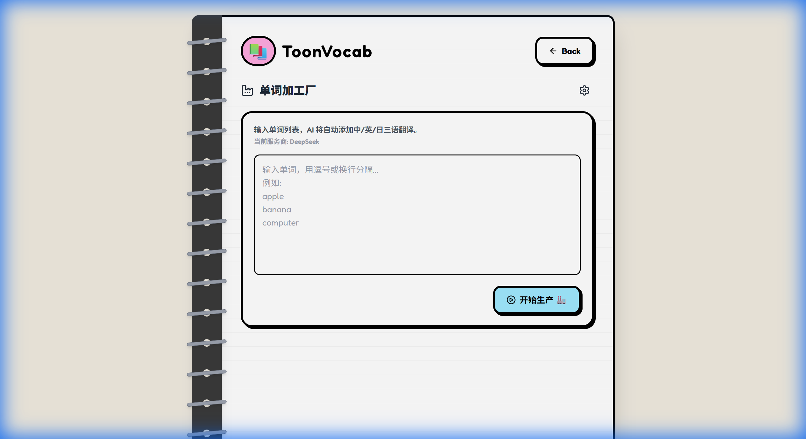
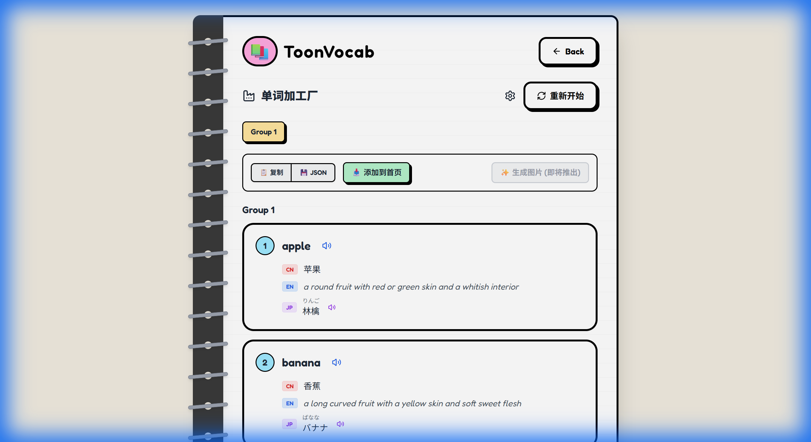
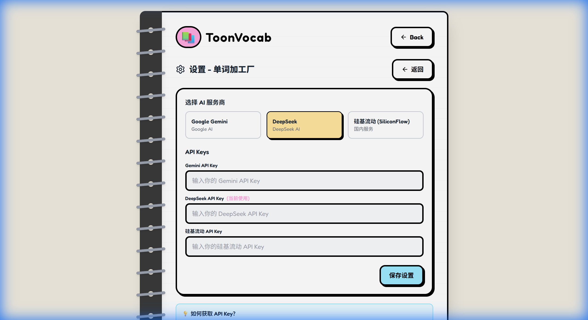
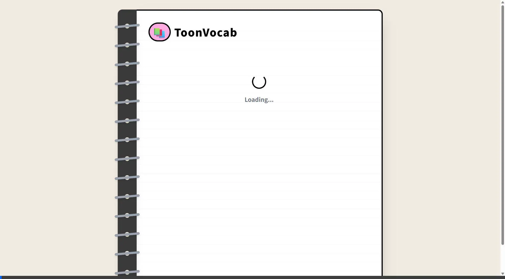
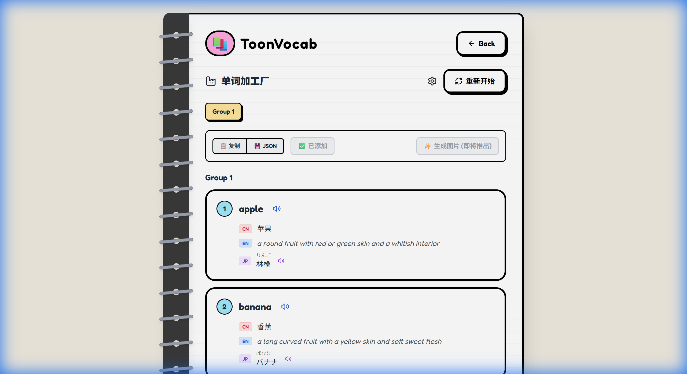

# 📚 ToonVocab - 卡通风格单词学习应用

一个有趣的单词学习 Web 应用，支持英语、中文和日语三语释义，带有可视化绘图上传功能。


---

## ✨ 特性

- 🎨 **卡通笔记本风格 UI** - 手绘风格界面，让学习更有趣
- 🌏 **三语支持** - 英语单词 + 中文释义 + 日语翻译（带假名注音）
- 🖼️ **图片上传** - 上传你的单词绘图笔记，帮助记忆
- 📥 **JSON 批量导入** - 复制粘贴 JSON 快速添加单词
- 💾 **本地持久化存储** - Node.js 后端，数据不会丢失
- ✅ **测试模式** - 检验学习成果
- 🧰 **工具箱** - 实用学习工具集合
- 📝 **文章选词器** - 从文章中快速选取生词，支持词组合并和实时翻译
- 🏭 **单词加工厂** - AI 自动翻译，支持 Gemini/DeepSeek/硅基流动 多服务商
- 🗜️ **图片压缩** - 一键压缩为 AVIF 格式，减少 60-80% 存储空间

---

## 🚀 快速开始

### 方式一：一键启动（推荐）

双击 `START_VOCABULARY.bat` 文件即可！

### 方式二：手动启动

需要打开**两个终端**：

```bash
# 终端 1 - 启动后端服务器
cd server
npm install  # 首次运行需要
npm start

# 终端 2 - 启动前端
npm install  # 首次运行需要
npm run dev
```

然后访问 http://localhost:3000/

### 关闭服务器

双击 `STOP_VOCABULARY.bat` 或在终端按 `Ctrl + C`

---

## 📖 使用指南

### 1️⃣ 主页 - 查看单词组


- 显示所有已创建的单词组（按日期分组）
- 点击卡片进入学习页面
- 点击 **New Day** 创建新的单词组
- 点击 **Import JSON** 批量导入单词
- 绿色卡片表示已通过测试

---

### 2️⃣ 学习页面 - 查看单词详情


- 查看每个单词的详细释义
  - 🔴 **CN** - 中文释义
  - 🔵 **EN** - 英语定义
  - ⚪ **JP** - 日语翻译（带假名注音）
- 上传你的**手绘单词图片**，点击上方区域即可上传
- 点击 **Edit** 编辑单词
- 点击 **Test** 开始测验

---

### 3️⃣ 编辑页面 - 添加/修改单词


- 修改每个单词的内容
- 每组固定 10 个单词槽位
- 填写完成后点击 **Save & Finish**

---

### 4️⃣ JSON 导入 - 批量添加


点击 **Import JSON** 按钮，粘贴以下格式的 JSON：

```json
{
  "title": "Day 5",
  "words": [
    {
      "term": "apple",
      "meaningCn": "苹果",
      "meaningEn": "a round fruit with red or green skin",
      "meaningJp": "りんご",
      "meaningJpReading": "りんご"
    },
    {
      "term": "banana",
      "meaningCn": "香蕉",
      "meaningEn": "a long curved yellow fruit",
      "meaningJp": "バナナ",
      "meaningJpReading": "ばなな"
    }
  ]
}
```

> 💡 `meaningJp` 和 `meaningJpReading` 是可选字段

---

### 5️⃣ 工具箱 - Toolbox

点击主页的 **Toolbox** 按钮可进入工具箱页面，包含以下实用工具：

#### 📝 Article Word Picker (文章选词器)

从英文文章中快速选取生词，支持词组合并和实时翻译。



**功能特点：**

- **粘贴文章** → 点击 "Start Picking" 进入选词模式
- **选词** → 点击单词高亮选中（粉色），再次点击取消
- **词组合并** → 选中两个相邻单词后，点击中间的 ⊕ 按钮合并为词组（紫色）
- **Times New Roman 字体** → 未选中文字使用衬线字体，选中词保持原样
- **悬浮翻译窗口** → 自动显示选中单词的英文释义（可拖动）
- **导出 JSON** → 一键导出所有选中的单词和词组



**操作演示：**


**导出格式示例：**

```json
{
  "exportedAt": "2025-12-20T10:05:00.000Z",
  "words": ["notable", "progress", "verifiable"],
  "phrases": ["strong and eventful", "paradigm changes"]
}
```

---

#### 🏭 Word Factory (单词加工厂)

使用 AI 自动为单词添加中/英/日三语翻译，支持多个 AI 服务商。



**功能特点：**

- **多服务商支持** → 支持 Google Gemini、DeepSeek、硅基流动 (SiliconFlow) 三个 AI 服务商
- **三语翻译** → 自动生成中文、英文、日语翻译及假名注音
- **分组处理** → 每10个单词为一组，独立处理
- **会话持久化** → 返回主页后数据不会丢失，只有点击"重新开始"才会清除
- **一键添加到首页** → 处理完成后可直接添加到主页单词组



**设置界面：**

点击右上角齿轮图标进入设置，可以选择 AI 服务商并配置 API Key。



| 服务商        | 模型             | 说明               |
| ------------- | ---------------- | ------------------ |
| Google Gemini | gemini-2.0-flash | 需要科学上网       |
| DeepSeek      | deepseek-chat    | 国内可用，性价比高 |
| 硅基流动      | DeepSeek-V3      | 国内服务，稳定快速 |

**操作演示：**



**添加到首页：**

处理完成后，点击"📥 添加到首页"按钮，输入组名即可将单词添加到主页。



---

#### 🗜️ 图片压缩功能

学习页面新增一键压缩功能，可将所有图片转换为 AVIF 格式，大幅减少存储空间。


**功能特点：**

- **一键压缩** → 点击"压缩全部图片"按钮，同时压缩主图和所有可视化图片
- **AVIF 格式** → 使用现代 AVIF 格式，压缩率极高
- **Squoosh 参数** → 采用与 Squoosh 相同的压缩配置（Quality: 50, Effort: 4）
- **自动替换** → 压缩后自动替换原图，删除旧文件
- **压缩报告** → 显示原始大小、压缩后大小、压缩比例

**使用方法：**

1. 进入任意单词组的学习页面
2. 确保已上传至少一张图片
3. 点击 **压缩全部图片** 按钮
4. 等待压缩完成，查看压缩报告

> 💡 通常可减少 60-80% 的文件大小！

---

## 📁 项目结构

```
web_Alphabet/
├── App.tsx              # 主应用组件
├── types.ts             # TypeScript 类型定义
├── services/
│   ├── wordService.ts   # 单词组 API 服务
│   ├── aiService.ts     # AI 多服务商接口 (Gemini/DeepSeek/SiliconFlow)
│   └── imageService.ts  # 图片压缩服务 (AVIF)
├── components/
│   ├── Button.tsx       # 按钮组件
│   └── Input.tsx        # 输入框组件
├── server/              # 后端服务器
│   ├── index.js         # Express 服务器主入口
│   ├── db.js            # JSON 文件存储逻辑
│   ├── data.json        # 数据存储文件（自动生成）
│   └── images/          # 上传的图片存储目录
├── docs/                # 文档和截图
├── START_VOCABULARY.bat # 一键启动脚本
└── STOP_VOCABULARY.bat  # 一键关闭脚本
```

---

## 🔧 技术栈

| 前端         | 后端          |
| ------------ | ------------- |
| React 19     | Node.js       |
| TypeScript   | Express       |
| Vite         | JSON 文件存储 |
| Tailwind CSS | -             |
| Lucide Icons | -             |

---

## 📝 API 接口

| 方法   | 端点                 | 说明           |
| ------ | -------------------- | -------------- |
| GET    | `/api/groups`        | 获取所有单词组 |
| GET    | `/api/groups/:id`    | 获取单个单词组 |
| POST   | `/api/groups`        | 创建新单词组   |
| PUT    | `/api/groups/:id`    | 更新单词组     |
| DELETE | `/api/groups/:id`    | 删除单词组     |
| POST   | `/api/groups/import` | JSON 批量导入  |

---

## 🎯 数据存储

- **单词数据**: `server/data.json`
- **上传的图片**: `server/images/` 目录（独立文件存储）

刷新页面或重启服务器后数据不会丢失！

---

## 📜 许可证

MIT License
